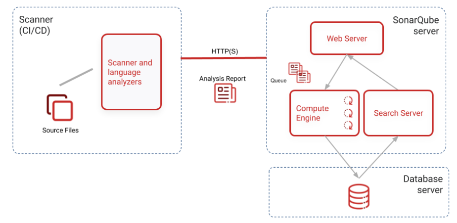
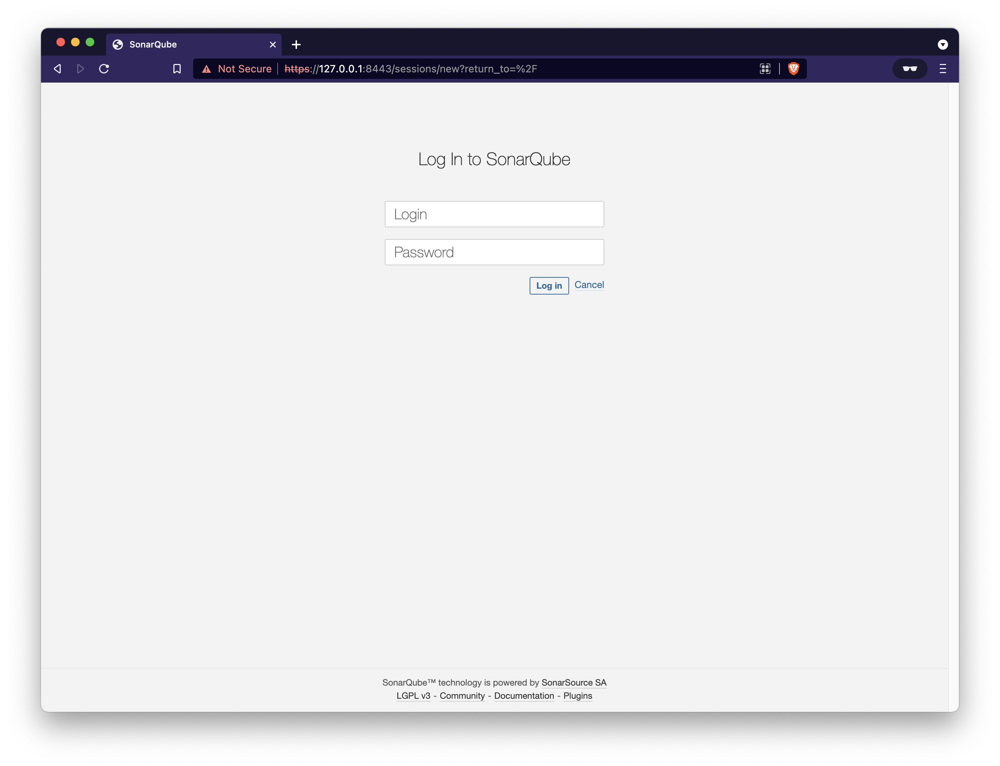

# SonarQube CE (Community Edition) - Docker

Notes on [SonarQube Community Edition](https://www.sonarqube.org/downloads/) as a docker deployment orchestrated by Docker Compose.

- Use the LTS version of SonarQube (v8.9)
- Use PostgreSQL as the database (v14)
- Use Nginx as the web server (v1)
- Include self-signed SSL certificate ([Let's Encrypt localhost](https://letsencrypt.org/docs/certificates-for-localhost/) format)

**DISCLAIMER: The code herein may not be up to date nor compliant with the most recent package and/or security notices. The frequency at which this code is reviewed and updated is based solely on the lifecycle of the project for which it was written to support, and is not actively maintained outside of that scope. Use at your own risk.**

## Table of contents

- [Overview](#overview)
    - [Host requirements](#hostreqts)
- [Configuration](#config)
- [Deploy](#deploy)
- [Example: Manually add a project](#example)
    - [Add a project](#addproject)
    - [Execute the scanner](#scanner)
- [GitHub integration](#github) (TODO)
- [Jenkins integration](#jenkins) (TODO)
- [Teardown](#teardown)
- [References](#references)
- [Notes](#notes)

## <a name="overview"></a>Overview

Details for the installation and usage of the Docker based SonarQube image. 

- Ref: [https://hub.docker.com/_/sonarqube/](https://hub.docker.com/_/sonarqube/)



### <a name="hostreqts"></a>Host requirements

- Because SonarQube uses an embedded Elasticsearch, make sure that your Docker host configuration complies with the Elasticsearch production mode requirements and File Descriptors configuration.
- For example, on Linux, you can set the recommended values for the current session by running the following commands as root on the host:

    As root
    
    ```
    sysctl -w vm.max_map_count=524288
    sysctl -w fs.file-max=131072
    ulimit -n 131072
    ulimit -u 8192
    ```

## <a name="config"></a>Configuration

Copy the `env.template` file as `.env` and populate according to your environment

```env
# docker-compose environment file
#
# When you set the same environment variable in multiple files,
# here’s the priority used by Compose to choose which value to use:
#
#  1. Compose file
#  2. Shell environment variables
#  3. Environment file
#  4. Dockerfile
#  5. Variable is not defined

# SonarQube Settings
export SONAR_JDBC_URL=jdbc:postgresql://database:5432/sonar
export SONAR_JDBC_USERNAME=sonar
export SONAR_JDBC_PASSWORD=sonar

# PostgreSQL Settings
export POSTGRES_USER=sonar
export POSTGRES_PASSWORD=sonar

# Nginx Settings
export NGINX_CONF=./nginx/default.conf
export NGINX_SSL_CERTS=./ssl
export NGINX_LOGS=./logs/nginx

# User Settings
# TBD
```

Modify the `nginx/default.conf` file to match your `SERVER DOMAIN` and `PORT`

```conf
upstream sonarqube {
    keepalive 32;
    server ce-sonarqube:9000;    # sonarqube ip and port
}

server {
    listen 80;                    # Listen on port 80 for IPv4 requests
    server_name $host;
    return 301 https://$host:8443$request_uri; # replace '8443' with your https port
}

server {
    listen          443 ssl;      # Listen on port 443 for IPv4 requests
    server_name     $host:8443;   # replace '$host:8443' with your server domain name and port

    # SSL certificate - replace as required with your own trusted certificate
    ssl_certificate /etc/ssl/fullchain.pem;
    ssl_certificate_key /etc/ssl/privkey.pem;

    # logging
    access_log /var/log/nginx/sonar.access.log;
    error_log /var/log/nginx/sonar.error.log;

    proxy_buffers 16 64k;
    proxy_buffer_size 128k;
    large_client_header_buffers 4 8k;

    location / {
        proxy_pass         http://sonarqube;
        proxy_redirect     default;
        proxy_http_version 1.1;
        proxy_next_upstream error timeout invalid_header http_500 http_502 http_503 http_504;

        proxy_set_header   Host              $host;
        proxy_set_header   X-Real-IP         $remote_addr;
        proxy_set_header   X-Forwarded-For   $proxy_add_x_forwarded_for;
        proxy_set_header   X-Forwarded-Proto $scheme;
        proxy_set_header   X-Forwarded-Host  $host;
        proxy_set_header   X-Forwarded-Port  8443;
    }
}
```

## <a name="deploy"></a>Deploy

Once configured the containers can be brought up using Docker Compose

```
source .env
docker-compose pull
docker-compose build
docker-compose up -d
```

After a few moments the containers should all be observed as `running`

```console
$ docker-compose ps
NAME                COMMAND                  SERVICE             STATUS              PORTS
ce-database         "docker-entrypoint.s…"   database            running             5432/tcp
ce-nginx            "/docker-entrypoint.…"   nginx               running             0.0.0.0:8080->80/tcp, 0.0.0.0:8443->443/tcp
ce-sonarqube        "bin/run.sh bin/sona…"   sonarqube           running             9000/tcp
```

The SonarQube application can be reached at the designated host and port (e.g. [https://127.0.0.1:8443]()). 

- **NOTE**: you will likely have to acknowledge the security risk if using the included self-signed certificate.



Use the default user/pass to log in initially as the `admin` user. You will be prompted to change the password after first login.

- user: **admin**
- pass: **admin**

Once a new password is set you'll see the Administrator's homepage


## <a name="example"></a>Example: Manually added project

### <a name="addproject"></a>Add a new project

Add a project manually from a local repository cloned from Github.

In the SonarQube UI:

1. Create a new project
    - From the upper right corner of the UI: `Add Project > Manually`
2. Enter values for:
    - **Project key** (e.g. project-registry)
    - **Display name** (e.g. project-registry)
3. Provide a token (or generate one)
    - **Enter a name for your token** (e.g. project-registry)
    - This yields a token: (e.g. `8aaf4c54b6d69f85bb89c08338c30f0b9a1ac251`)
4. Run analysis on your project
    - **What option best describes your build?** (e.g. Python)
    - **What is your OS?** (e.g. macOS)

At this point SonarQube will provide some information on how to execute the scanner


### <a name="scanner"></a>Execute the Scanner from your computer

With the [sonarsource/sonar-scanner-cli](https://hub.docker.com/r/sonarsource/sonar-scanner-cli) Docker image use the information provided in the UI to run the scan

```
sonar-scanner \
  -Dsonar.projectKey=project-registry \
  -Dsonar.sources=. \
  -Dsonar.host.url=https://127.0.0.1:8443 \
  -Dsonar.login=8aaf4c54b6d69f85bb89c08338c30f0b9a1ac251
```

Create a file named `sonar-project.properties` in your repository with the appropriate values

Example: `sonar-project.properties` file

```
# must be unique in a given SonarQube instance
sonar.projectKey=my:project

# --- optional properties ---

# defaults to project key
#sonar.projectName=My project
# defaults to 'not provided'
#sonar.projectVersion=1.0
 
# Path is relative to the sonar-project.properties file. Defaults to .
#sonar.sources=.
 
# Encoding of the source code. Default is default system encoding
#sonar.sourceEncoding=UTF-8
```

Prepare the appropriate `docker run` call for the scanner.

```
docker run \
    --rm \
    -e SONAR_HOST_URL="http://${SONARQUBE_URL}" \
    -e SONAR_LOGIN="${MY_AUTHENTICATION_TOKEN}" \
    -v "${SOURCE_REPO}:/usr/src" \
    sonarsource/sonar-scanner-cli
```

- **NOTE**: If executing on the same server that is running the docker based SonarQube:
    - Use the docker-compose network (e.g. `--network="${MY_COMPOSE_NETWORK}"`)
    - `SONAR_HOST_URL`: connect to the `sonarqube` container by it's docker-compose name (e.g. `sonarqube:9000`)

Example using `sonar-scanner-cli` to scan the `project-registry` code

```console
export SONARQUBE_URL='sonarqube:9000'
export SOURCE_REPO=$(pwd)'/project-registry'
export MY_AUTHENTICATION_TOKEN='8aaf4c54b6d69f85bb89c08338c30f0b9a1ac251'
export MY_COMPOSE_NETWORK='ce-sonar'

docker run \
    --rm \
    -e SONAR_HOST_URL="http://${SONARQUBE_URL}" \
    -e SONAR_LOGIN="${MY_AUTHENTICATION_TOKEN}" \
    -v "${SOURCE_REPO}:/usr/src" \
    --network="${MY_COMPOSE_NETWORK}" \
    sonarsource/sonar-scanner-cli
```

If successful there should be output similar to

```console
INFO: Scanner configuration file: /opt/sonar-scanner/conf/sonar-scanner.properties
INFO: Project root configuration file: /usr/src/sonar-project.properties
INFO: SonarScanner 4.6.2.2472
INFO: Java 11.0.12 Alpine (64-bit)
INFO: Linux 5.10.76-linuxkit amd64
INFO: User cache: /opt/sonar-scanner/.sonar/cache
INFO: Scanner configuration file: /opt/sonar-scanner/conf/sonar-scanner.properties
INFO: Project root configuration file: /usr/src/sonar-project.properties
INFO: Analyzing on SonarQube server 8.9.6
...
INFO: SCM Publisher SCM provider for this project is: git
INFO: SCM Publisher 30 source files to be analyzed
INFO: SCM Publisher 30/30 source files have been analyzed (done) | time=1393ms
INFO: CPD Executor 6 files had no CPD blocks
INFO: CPD Executor Calculating CPD for 26 files
INFO: CPD Executor CPD calculation finished (done) | time=120ms
INFO: Analysis report generated in 330ms, dir size=360 KB
INFO: Analysis report compressed in 12768ms, zip size=128 KB
INFO: Analysis report uploaded in 62ms
INFO: ANALYSIS SUCCESSFUL, you can browse http://sonarqube:9000/dashboard?id=project-registry
INFO: Note that you will be able to access the updated dashboard once the server has processed the submitted analysis report
INFO: More about the report processing at http://sonarqube:9000/api/ce/task?id=AX6JMCIvWWXSLK7V_fZf
INFO: Analysis total time: 34.960 s
INFO: ------------------------------------------------------------------------
INFO: EXECUTION SUCCESS
INFO: ------------------------------------------------------------------------
INFO: Total time: 38.645s
INFO: Final Memory: 7M/40M
INFO: ------------------------------------------------------------------------
```

And the project page will update with the results


## <a name="github"></a>GitHub integration

TODO

Reference: [https://docs.sonarqube.org/8.9/analysis/github-integration/](https://docs.sonarqube.org/8.9/analysis/github-integration/)

## <a name="jenkins"></a>Jenkins integration

TODO

Reference: [https://docs.sonarqube.org/8.9/analysis/scan/sonarscanner-for-jenkins/](https://docs.sonarqube.org/8.9/analysis/scan/sonarscanner-for-jenkins/)

## <a name="teardown"></a>Teardown

All containers must be stopped and removed along with the volumes and network that were created for the application containers

Commands

```console
docker-compose stop
docker-compose rm -fv
docker volume rm ce-postgresql ce-postgresql-data ce-sonarqube-data ce-sonarqube-extensions ce-sonarqube-logs 
docker network rm ce-sonar
```

Expected output

```console
$ docker-compose stop
[+] Running 3/3
 ⠿ Container ce-nginx      Stopped                                                                                                     0.2s
 ⠿ Container ce-sonarqube  Stopped                                                                                                     1.4s
 ⠿ Container ce-database   Stopped
$ docker-compose rm -fv
Going to remove ce-nginx, ce-sonarqube, ce-database
[+] Running 3/0
 ⠿ Container ce-database   Removed                                                                                                     0.0s
 ⠿ Container ce-sonarqube  Removed                                                                                                     0.1s
 ⠿ Container ce-nginx      Removed
$ docker volume rm ce-postgresql ce-postgresql-data ce-sonarqube-data ce-sonarqube-extensions ce-sonarqube-logs
ce-postgresql
ce-postgresql-data
ce-sonarqube-data
ce-sonarqube-extensions
ce-sonarqube-logs
$ docker network rm ce-sonar
ce-sonar
```

## <a name="references"></a>References

- SonarQube Documentation: [https://docs.sonarqube.org/latest/](https://docs.sonarqube.org/latest/)
- Docker images: [https://hub.docker.com/_/sonarqube/](https://hub.docker.com/_/sonarqube/)

---

## <a name="notes"></a>Notes

General information regarding standard Docker deployment of SonarQube for reference purposes

### Installing SonarQube from the Docker Image

Follow these steps for your first installation:

1. Creating the following volumes helps prevent the loss of information when updating to a new version or upgrading to a higher edition:
    - `sonarqube_data` – contains data files, such as the embedded H2 database and Elasticsearch indexes
    - `sonarqube_logs` – contains SonarQube logs about access, web process, CE process, and Elasticsearch
    - `sonarqube_extensions` – will contain any plugins you install and the Oracle JDBC driver if necessary.

    Create the volumes with the following commands:
    
    ```
    docker volume create --name sonarqube_data
    docker volume create --name sonarqube_logs
    docker volume create --name sonarqube_extensions
    ```

2. Drivers for supported databases (except Oracle) are already provided.
    - Create the database volumes (e.g. PostgreSQL):

    ```
    docker volume create --name postgresql_data
    docker volume create --name postgresql
    ```
3. Run the image with your database properties defined using the `-e` environment variable flag:

    ```
    docker run -d --name sonarqube \
        -p 9000:9000 \
        -e SONAR_JDBC_URL=... \
        -e SONAR_JDBC_USERNAME=... \
        -e SONAR_JDBC_PASSWORD=... \
        -v sonarqube_data:/opt/sonarqube/data \
        -v sonarqube_extensions:/opt/sonarqube/extensions \
        -v sonarqube_logs:/opt/sonarqube/logs \
        <image_name>
    ```

### Example Compose definition

```yaml
version: "3"

services:
  sonarqube:
    image: sonarqube:community
    depends_on:
      - db
    environment:
      SONAR_JDBC_URL: jdbc:postgresql://db:5432/sonar
      SONAR_JDBC_USERNAME: sonar
      SONAR_JDBC_PASSWORD: sonar
    volumes:
      - sonarqube_data:/opt/sonarqube/data
      - sonarqube_extensions:/opt/sonarqube/extensions
      - sonarqube_logs:/opt/sonarqube/logs
    ports:
      - "9000:9000"
  db:
    image: postgres:12
    environment:
      POSTGRES_USER: sonar
      POSTGRES_PASSWORD: sonar
    volumes:
      - postgresql:/var/lib/postgresql
      - postgresql_data:/var/lib/postgresql/data

volumes:
  sonarqube_data:
  sonarqube_extensions:
  sonarqube_logs:
  postgresql:
  postgresql_data:
```


