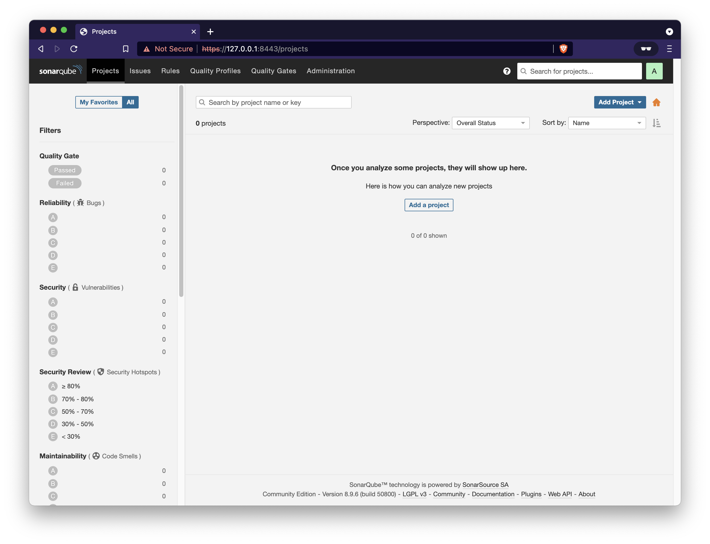
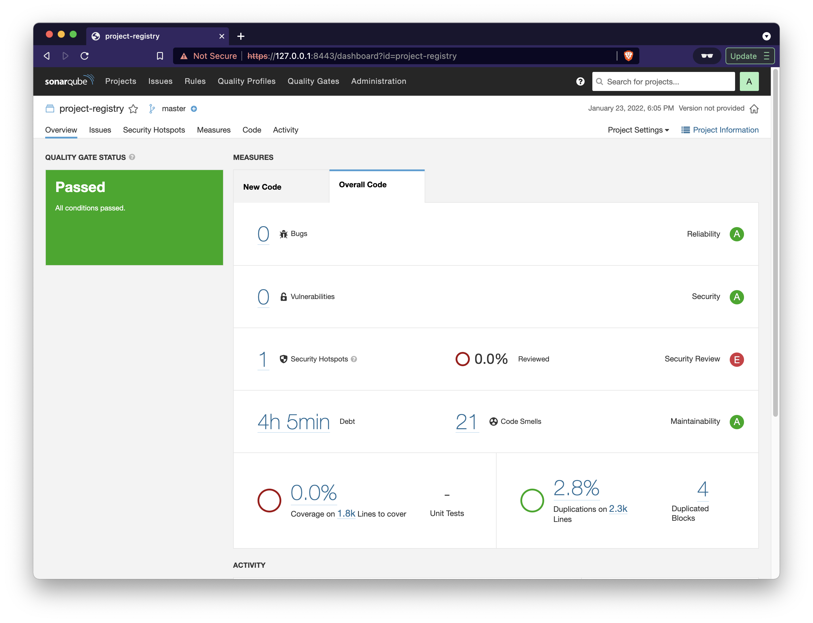
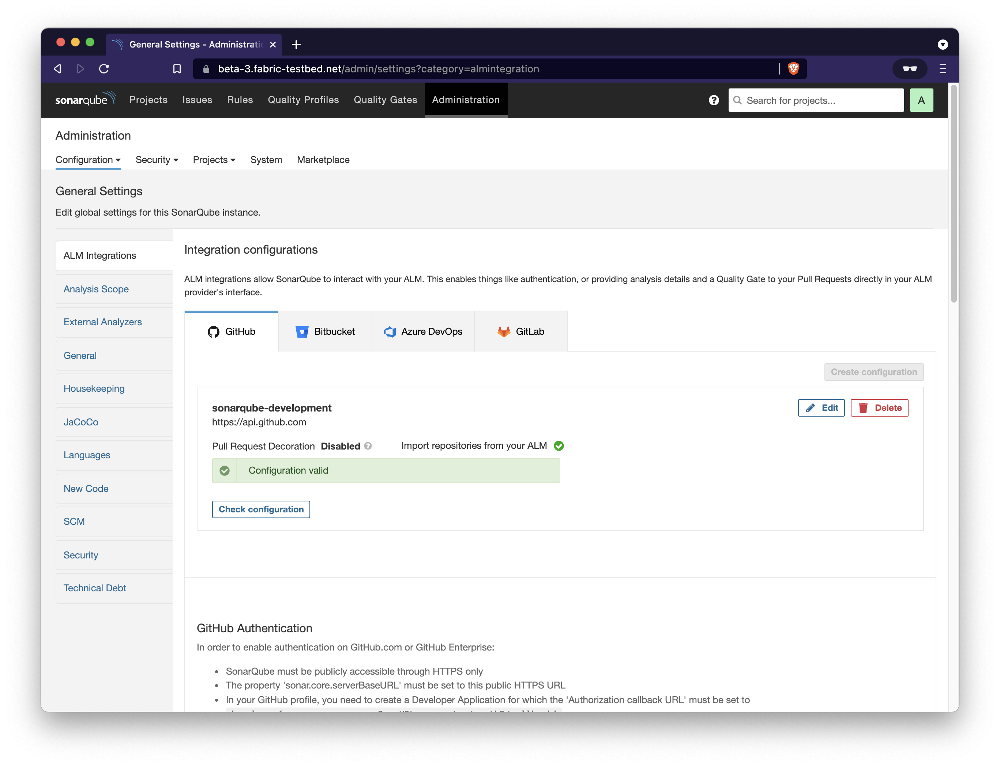
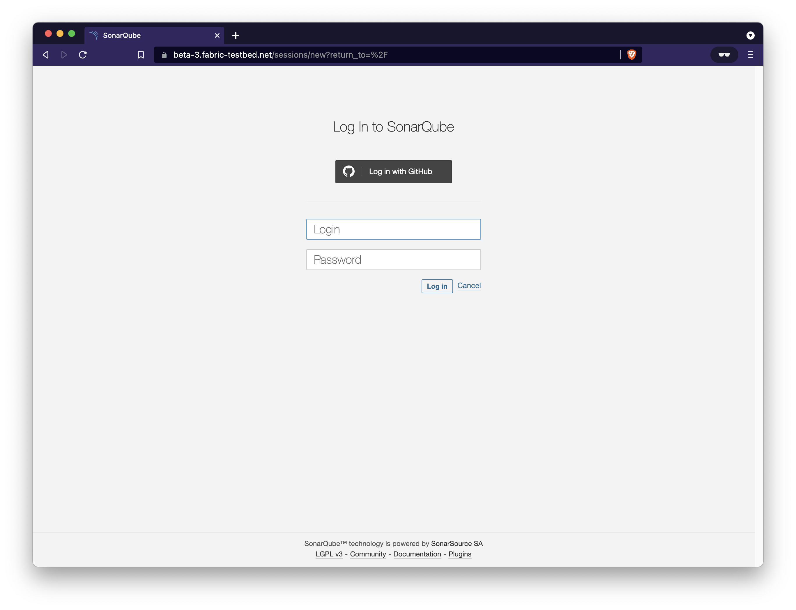
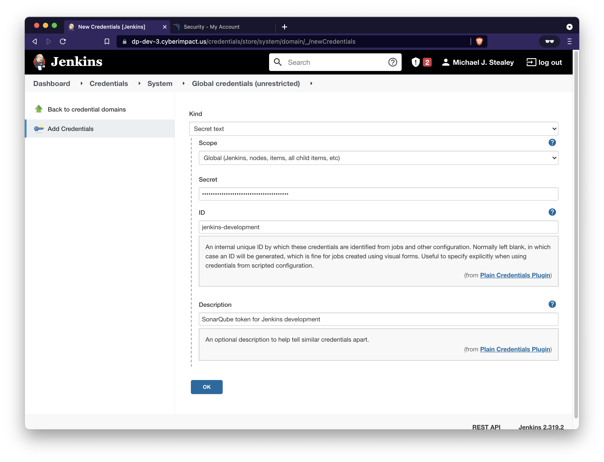
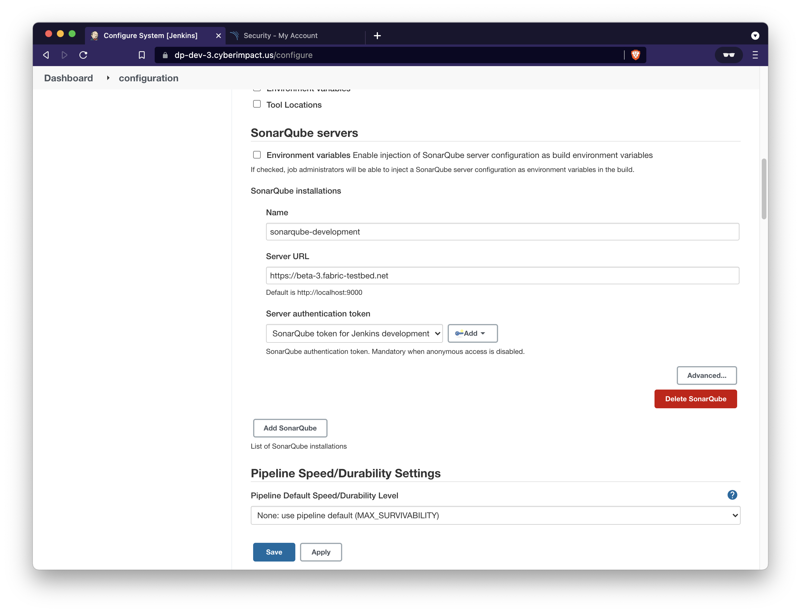
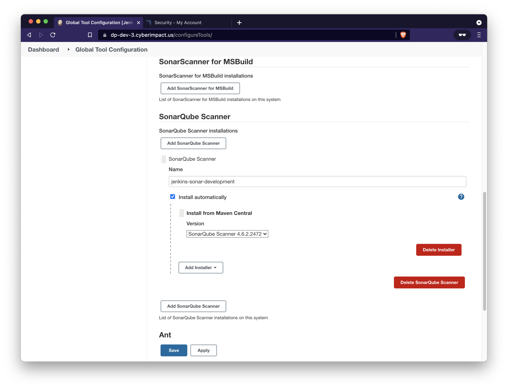

# SonarQube CE (Community Edition) - Docker

Notes on [SonarQube Community Edition](https://www.sonarqube.org/downloads/) as a docker deployment orchestrated by Docker Compose.

- Use the LTS version of SonarQube (v8.9)
- Use PostgreSQL as the database (v14)
- Use Nginx as the web server (v1)
- Include self-signed SSL certificate ([Let's Encrypt localhost](https://letsencrypt.org/docs/certificates-for-localhost/) format)

**DISCLAIMER: The code herein may not be up to date nor compliant with the most recent package and/or security notices. The frequency at which this code is reviewed and updated is based solely on the lifecycle of the project for which it was written to support, and is not actively maintained outside of that scope. Use at your own risk.**

## Table of contents

- [Overview](#overview)
    - [Host requirements](#hostreqts)
- [Configuration](#config)
- [Deploy](#deploy)
- [Example: Manually add a project](#example)
    - [Add a project](#addproject)
    - [Execute the scanner](#scanner)
- [GitHub integration](#github)
- [Jenkins integration](#jenkins)
- [Teardown](#teardown)
- [References](#references)
- [Notes](#notes)

## <a name="overview"></a>Overview

Details for the installation and usage of the Docker based SonarQube image. 

- Ref: [https://hub.docker.com/_/sonarqube/](https://hub.docker.com/_/sonarqube/)


### <a name="hostreqts"></a>Host requirements

- Because SonarQube uses an embedded Elasticsearch, make sure that your Docker host configuration complies with the Elasticsearch production mode requirements and File Descriptors configuration.
- For example, on Linux, you can set the recommended values for the current session by running the following commands as root on the host:

    As root
    
    ```console
    sysctl -w vm.max_map_count=524288
    sysctl -w fs.file-max=131072
    ulimit -n 131072
    ulimit -u 8192
    ```

## <a name="config"></a>Configuration

Copy the `env.template` file as `.env` and populate according to your environment

```ini
# docker-compose environment file
#
# When you set the same environment variable in multiple files,
# here’s the priority used by Compose to choose which value to use:
#
#  1. Compose file
#  2. Shell environment variables
#  3. Environment file
#  4. Dockerfile
#  5. Variable is not defined

# SonarQube Settings
export SONAR_JDBC_URL=jdbc:postgresql://database:5432/sonar
export SONAR_JDBC_USERNAME=sonar
export SONAR_JDBC_PASSWORD=sonar

# PostgreSQL Settings
export POSTGRES_USER=sonar
export POSTGRES_PASSWORD=sonar

# Nginx Settings
export NGINX_CONF=./nginx/default.conf
export NGINX_SSL_CERTS=./ssl
export NGINX_LOGS=./logs/nginx

# User Settings
# TBD
```

Modify the `nginx/default.conf` file to match your `SERVER DOMAIN` and `PORT`

```conf
upstream sonarqube {
    keepalive 32;
    server ce-sonarqube:9000;    # sonarqube ip and port
}

server {
    listen 80;                    # Listen on port 80 for IPv4 requests
    server_name $host;
    return 301 https://$host:8443$request_uri; # replace '8443' with your https port
}

server {
    listen          443 ssl;      # Listen on port 443 for IPv4 requests
    server_name     $host:8443;   # replace '$host:8443' with your server domain name and port

    # SSL certificate - replace as required with your own trusted certificate
    ssl_certificate /etc/ssl/fullchain.pem;
    ssl_certificate_key /etc/ssl/privkey.pem;

    # logging
    access_log /var/log/nginx/sonar.access.log;
    error_log /var/log/nginx/sonar.error.log;

    proxy_buffers 16 64k;
    proxy_buffer_size 128k;
    large_client_header_buffers 4 8k;

    location / {
        proxy_pass         http://sonarqube;
        proxy_redirect     default;
        proxy_http_version 1.1;
        proxy_next_upstream error timeout invalid_header http_500 http_502 http_503 http_504;

        proxy_set_header   Host              $host;
        proxy_set_header   X-Real-IP         $remote_addr;
        proxy_set_header   X-Forwarded-For   $proxy_add_x_forwarded_for;
        proxy_set_header   X-Forwarded-Proto $scheme;
        proxy_set_header   X-Forwarded-Host  $host;
        proxy_set_header   X-Forwarded-Port  8443;
    }
}
```

## <a name="deploy"></a>Deploy

Once configured the containers can be brought up using Docker Compose

```console
source .env
docker-compose pull
docker-compose up -d
```

After a few moments the containers should all be observed as `running`

```console
$ docker-compose ps
NAME                COMMAND                  SERVICE             STATUS              PORTS
ce-database         "docker-entrypoint.s…"   database            running             5432/tcp
ce-nginx            "/docker-entrypoint.…"   nginx               running             0.0.0.0:8080->80/tcp, 0.0.0.0:8443->443/tcp
ce-sonarqube        "bin/run.sh bin/sona…"   sonarqube           running             9000/tcp
```

The SonarQube application can be reached at the designated host and port (e.g. [https://127.0.0.1:8443]()). 

- **NOTE**: you will likely have to acknowledge the security risk if using the included self-signed certificate.

Use the default user/pass to log in initially as the `admin` user. You will be prompted to change the password after first login.

- user: **admin**
- pass: **admin**


Once a new password is set you'll see the Administrator's homepage



## <a name="example"></a>Example: Manually added project

### <a name="addproject"></a>Add a new project

Add a project manually from a local repository cloned from Github.

In the SonarQube UI:

1. Create a new project
    - From the upper right corner of the UI: `Add Project > Manually`
2. Enter values for:
    - **Project key** (e.g. project-registry)
    - **Display name** (e.g. project-registry)
3. Provide a token (or generate one)
    - **Enter a name for your token** (e.g. project-registry)
    - This yields a token: (e.g. `8aaf4c54b6d69f85bb89c08338c30f0b9a1ac251`)
4. Run analysis on your project
    - **What option best describes your build?** (e.g. Python)
    - **What is your OS?** (e.g. macOS)

At this point SonarQube will provide some information on how to execute the scanner


### <a name="scanner"></a>Execute the Scanner from your computer

With the [sonarsource/sonar-scanner-cli](https://hub.docker.com/r/sonarsource/sonar-scanner-cli) Docker image use the information provided in the UI to run the scan

```ini
sonar-scanner \
  -Dsonar.projectKey=project-registry \
  -Dsonar.sources=. \
  -Dsonar.host.url=https://127.0.0.1:8443 \
  -Dsonar.login=8aaf4c54b6d69f85bb89c08338c30f0b9a1ac251
```

Create a file named `sonar-project.properties` in your repository with the appropriate values

Example: `sonar-project.properties` file

```ini
# --- required properties ---

# must be unique in a given SonarQube instance
sonar.projectKey=my:project


# --- optional properties ---

# defaults to project key
#sonar.projectName=My project
# defaults to 'not provided'
#sonar.projectVersion=1.0
 
# Path is relative to the sonar-project.properties file. Defaults to .
#sonar.sources=.
 
# Encoding of the source code. Default is default system encoding
#sonar.sourceEncoding=UTF-8
```

Prepare the appropriate `docker run` call for the scanner.

```
docker run \
    --rm \
    -e SONAR_HOST_URL="http://${SONAR_HOST_URL}" \
    -e SONAR_LOGIN="${SONAR_LOGIN_TOKEN}" \
    -v "${SONAR_SOURCE_REPO}:/usr/src" \
    sonarsource/sonar-scanner-cli
```

- **NOTE**: If executing on the same server that is running the docker based SonarQube:
    - Use the docker-compose network (e.g. `--network="${SONAR_COMPOSE_NETWORK}"`)
    - `SONAR_HOST_URL `: connect to the `sonarqube` container by it's docker-compose name (e.g. `http://sonarqube:9000`)

Example using `sonar-scanner-cli` to scan the `project-registry` code

```console
export SONAR_HOST_URL='http://sonarqube:9000'
export SONAR_SOURCE_REPO=$(pwd)'/project-registry'
export SONAR_LOGIN_TOKEN ='8aaf4c54b6d69f85bb89c08338c30f0b9a1ac251'
export SONAR_COMPOSE_NETWORK='ce-sonar'

docker run \
    --rm \
    -e SONAR_HOST_URL="${SONAR_HOST_URL}" \
    -e SONAR_LOGIN="${SONAR_LOGIN_TOKEN}" \
    -v "${SONAR_SOURCE_REPO}:/usr/src" \
    --network="${SONAR_COMPOSE_NETWORK}" \
    sonarsource/sonar-scanner-cli
```

If successful there should be output similar to

```console
INFO: Scanner configuration file: /opt/sonar-scanner/conf/sonar-scanner.properties
INFO: Project root configuration file: /usr/src/sonar-project.properties
INFO: SonarScanner 4.6.2.2472
INFO: Java 11.0.12 Alpine (64-bit)
INFO: Linux 5.10.76-linuxkit amd64
INFO: User cache: /opt/sonar-scanner/.sonar/cache
INFO: Scanner configuration file: /opt/sonar-scanner/conf/sonar-scanner.properties
INFO: Project root configuration file: /usr/src/sonar-project.properties
INFO: Analyzing on SonarQube server 8.9.6
...
INFO: SCM Publisher SCM provider for this project is: git
INFO: SCM Publisher 30 source files to be analyzed
INFO: SCM Publisher 30/30 source files have been analyzed (done) | time=1393ms
INFO: CPD Executor 6 files had no CPD blocks
INFO: CPD Executor Calculating CPD for 26 files
INFO: CPD Executor CPD calculation finished (done) | time=120ms
INFO: Analysis report generated in 330ms, dir size=360 KB
INFO: Analysis report compressed in 12768ms, zip size=128 KB
INFO: Analysis report uploaded in 62ms
INFO: ANALYSIS SUCCESSFUL, you can browse http://sonarqube:9000/dashboard?id=project-registry
INFO: Note that you will be able to access the updated dashboard once the server has processed the submitted analysis report
INFO: More about the report processing at http://sonarqube:9000/api/ce/task?id=AX6JMCIvWWXSLK7V_fZf
INFO: Analysis total time: 34.960 s
INFO: ------------------------------------------------------------------------
INFO: EXECUTION SUCCESS
INFO: ------------------------------------------------------------------------
INFO: Total time: 38.645s
INFO: Final Memory: 7M/40M
INFO: ------------------------------------------------------------------------
```

And the project page will update with the results



## <a name="github"></a>GitHub integration

### Step 1: Creating your GitHub App

**For security reasons, make sure you're using HTTPS protocol for your URLs in your app.**

See GitHub's documentation on [creating a GitHub App](https://docs.github.com/apps/building-github-apps/creating-a-github-app/) for general information on creating your app.

Specify the following settings in your app:

- **GitHub App Name** – Your app's name.
- **Homepage URL** – You can use any URL, such as https://www.sonarqube.org/.
- **User authorization callback URL** – Your instance's base URL. For example, https://yourinstance.sonarqube.com.
- **Webhook UR**L – Your instance's base URL. For example, https://yourinstance.sonarqube.com.
- Grant access for the following **Repository permissions**:

    **Permission** | **Access**
    :----------|:-----------
    Checks	| Read & write
    **GitHub Enterprise**: Repository metadata | Read-only
    **GitHub.com**: Metadata (this setting is automatically set by GitHub) | Read-only
    Pull Requests | Read & write
    Commit statuses | Read-only

- And grant access for the following **Organization permissions**:

    **Permission** | **Access**
    :----------|:-----------
    Members | Read-only
    Projects | Read-only
    
- If setting up **GitHub Authentication**, in addition to the aforementioned Repository permissions, grant access for the following **User permissions**:

    **Permission** | **Access**
    :----------|:-----------
    Email addresses	| Read-only

- Under "Where can this GitHub App be installed?," select **Any account**.

### Step 2: Installing your GitHub App in your organization

Next, you need to install your GitHub App in your organizations. See GitHub's documentation on [installing GitHub Apps](https://docs.github.com/en/free-pro-team@latest/developers/apps/installing-github-apps) for more information.

### Step 3: Updating your SonarQube global settings with your GitHub App information

After you've created and installed your GitHub App, update your global SonarQube settings to finish integration and allow for the import of GitHub projects.

Navigate to **Administration > Configuration > General Settings > ALM Integrations > GitHub** and specify the following settings:

- **Configuration Name** (Enterprise and Data Center Edition only) – The name used to identify your GitHub configuration at the project level. Use something succinct and easily recognizable.
- **GitHub URL** – For example, `https://github.company.com/api/v3` for GitHub Enterprise or `https://api.github.com/` for GitHub.com.
- **GitHub App ID** – The App ID is found on your GitHub App's page on GitHub at **Settings > Developer Settings > GitHub Apps**.
- **Client ID** – The Client ID is found on your GitHub App's page.
- **Client secret** – The Client secret is found on your GitHub App's page.
- **Private Key** – Your GitHub App's private key. You can generate a `.pem` file from your GitHub App's page under **Private keys**. Copy and paste the contents of the file here.

### Step 4: Setting up GitHub authentication

**If you're using Community Edition or you want to use a dedicated app for GitHub authentication, see the Creating a dedicated app for authentication section below.**

To allow users to log in with GitHub credentials, use the GitHub App that you created above (see the **Importing your GitHub repositories using a GitHub App** section for more information) and update your global SonarQube settings.

To update your global SonarQube settings:

Navigate to **Administration > Configuration > General Settings > ALM Integrations > GitHub > GitHub Authentication** and update the following:

1. **Enabled** – set the switch to true.
2. **Client ID** – the Client ID is found below the GitHub App ID on your GitHub App's page.
3. **Client Secret** – the Client secret is found below the Client ID on your GitHub App's page.
Now, from the login page, your users can connect their GitHub accounts with the new "Log in with GitHub" button.

### Creating a dedicated app for authentication

If you want to use a dedicated app for GitHub authentication, you can create a GitHub OAuth app. You'll find general instructions for creating a GitHub OAuth App [here](https://docs.github.com/en/free-pro-team@latest/developers/apps/creating-an-oauth-app). Specify the following settings in your OAuth App:

- Homepage URL – the public URL of your SonarQube server. For example, `https://sonarqube.mycompany.com`. For security reasons, HTTP is not supported, and you must use HTTPS. The public URL is configured in SonarQube at **Administration > General > Server base URL**.
- Authorization callback URL – your instance's base URL. For example, https://yourinstance.sonarqube.com.
After creating your app, update your global SonarQube settings:

Navigate to **Administration > Configuration > General Settings > ALM Integrations > GitHub > GitHub Authentication** and update the following:

- **Enabled** – set the switch to true.
- **Client ID** – the Client ID is found below the GitHub App ID on your GitHub App's page.
- **Client Secret** – the Client secret is found below the Client ID on your GitHub App's page.
Now, from the login page, your users can connect their GitHub accounts with the new "Log in with GitHub" button.

When completed the configuration can be checked from the **Administration > Configuration > General Settings > ALM Integrations** panel



And the "Log in with GitHub" button will now be available (in addition to standard user/pass authentication)

 

Reference: [https://docs.sonarqube.org/8.9/analysis/github-integration/](https://docs.sonarqube.org/8.9/analysis/github-integration/)

## <a name="jenkins"></a>Jenkins integration

### SonarScanner for Jenkins

This plugin lets you centralize the configuration of SonarQube server connection details in Jenkins global configuration.

Then you can trigger SonarQube analysis from Jenkins using standard Jenkins Build Steps or [Jenkins Pipeline DSL](https://jenkins.io/solutions/pipeline/) to trigger analysis with:

- SonarScanner
- SonarScanner for Maven
- SonarScanner for Gradle
- SonarScanner for .NET

Once the job is complete, the plugin will detect that a SonarQube analysis was made during the build and display a badge and a widget on the job page with a link to the SonarQube dashboard as well as quality gate status.

### Installation

1. Install the [SonarQube Scanner for Jenkins](https://plugins.jenkins.io/sonar) via the Jenkins Update Center.
2. Configure your SonarQube server(s):
    - Log into Jenkins as an administrator and go to **Manage Jenkins > Configure System**.
    - Scroll down to the SonarQube configuration section, click **Add SonarQube**, and add the values you're prompted for.
    - The server [authentication token](https://docs.sonarqube.org/8.9/user-guide/user-token/) should be created as a 'Secret Text' credential.





### Analyzing other project types

**Global Configuration**

This step is mandatory if you want to trigger any of your SonarQube analyses with the SonarScanner. You can define as many scanner instances as you wish. Then for each Jenkins job, you will be able to choose which launcher to use to run the SonarQube analysis.

1. Log into Jenkins as an administrator and go to **Manage Jenkins > Global Tool Configuration**
2. Scroll down to the SonarScanner configuration section and click on Add SonarScanner. It is based on the typical Jenkins tool auto-installation. You can either choose to point to an already installed version of SonarScanner (uncheck 'Install automatically') or tell Jenkins to grab the installer from a remote location (check 'Install automatically')

If you don't see a drop-down list with all available SonarScanner versions but instead see an empty text field then this is because Jenkins still hasn't downloaded the required update center file (default period is 1 day). You may force this refresh by clicking the 'Check Now' button in **Manage Plugins > Advanced** tab.



**Job Configuration**

1. **Configure** the project, and go to the **Build** section.
2. Add the SonarScanner build step to your build.
3. Configure the SonarQube analysis properties. You can either point to an existing `sonar-project.properties` file or set the analysis properties directly in the **Analysis properties** field
    


Reference: [https://docs.sonarqube.org/8.9/analysis/scan/sonarscanner-for-jenkins/](https://docs.sonarqube.org/8.9/analysis/scan/sonarscanner-for-jenkins/)

## <a name="teardown"></a>Teardown

All containers must be stopped and removed along with the volumes and network that were created for the application containers

Commands

```console
docker-compose stop
docker-compose rm -fv
docker volume rm ce-postgresql ce-postgresql-data ce-sonarqube-data ce-sonarqube-extensions ce-sonarqube-logs 
docker network rm ce-sonar
```

Expected output

```console
$ docker-compose stop
[+] Running 3/3
 ⠿ Container ce-nginx      Stopped                                                                                                     0.2s
 ⠿ Container ce-sonarqube  Stopped                                                                                                     1.4s
 ⠿ Container ce-database   Stopped
$ docker-compose rm -fv
Going to remove ce-nginx, ce-sonarqube, ce-database
[+] Running 3/0
 ⠿ Container ce-database   Removed                                                                                                     0.0s
 ⠿ Container ce-sonarqube  Removed                                                                                                     0.1s
 ⠿ Container ce-nginx      Removed
$ docker volume rm ce-postgresql ce-postgresql-data ce-sonarqube-data ce-sonarqube-extensions ce-sonarqube-logs
ce-postgresql
ce-postgresql-data
ce-sonarqube-data
ce-sonarqube-extensions
ce-sonarqube-logs
$ docker network rm ce-sonar
ce-sonar
```

## <a name="references"></a>References

- SonarQube Documentation: [https://docs.sonarqube.org/latest/](https://docs.sonarqube.org/latest/)
- Docker images: [https://hub.docker.com/_/sonarqube/](https://hub.docker.com/_/sonarqube/)

---

## <a name="notes"></a>Notes

General information regarding standard Docker deployment of SonarQube for reference purposes

### Installing SonarQube from the Docker Image

Follow these steps for your first installation:

1. Creating the following volumes helps prevent the loss of information when updating to a new version or upgrading to a higher edition:
    - `sonarqube_data` – contains data files, such as the embedded H2 database and Elasticsearch indexes
    - `sonarqube_logs` – contains SonarQube logs about access, web process, CE process, and Elasticsearch
    - `sonarqube_extensions` – will contain any plugins you install and the Oracle JDBC driver if necessary.

    Create the volumes with the following commands:
    
    ```console
    docker volume create --name sonarqube_data
    docker volume create --name sonarqube_logs
    docker volume create --name sonarqube_extensions
    ```

2. Drivers for supported databases (except Oracle) are already provided.
    - Create the database volumes (e.g. PostgreSQL):

    ```console
    docker volume create --name postgresql_data
    docker volume create --name postgresql
    ```
3. Run the image with your database properties defined using the `-e` environment variable flag:

    ```console
    docker run -d --name sonarqube \
        -p 9000:9000 \
        -e SONAR_JDBC_URL=... \
        -e SONAR_JDBC_USERNAME=... \
        -e SONAR_JDBC_PASSWORD=... \
        -v sonarqube_data:/opt/sonarqube/data \
        -v sonarqube_extensions:/opt/sonarqube/extensions \
        -v sonarqube_logs:/opt/sonarqube/logs \
        <image_name>
    ```

### Example Compose definition

```yaml
version: "3"

services:
  sonarqube:
    image: sonarqube:community
    depends_on:
      - db
    environment:
      SONAR_JDBC_URL: jdbc:postgresql://db:5432/sonar
      SONAR_JDBC_USERNAME: sonar
      SONAR_JDBC_PASSWORD: sonar
    volumes:
      - sonarqube_data:/opt/sonarqube/data
      - sonarqube_extensions:/opt/sonarqube/extensions
      - sonarqube_logs:/opt/sonarqube/logs
    ports:
      - "9000:9000"
  db:
    image: postgres:12
    environment:
      POSTGRES_USER: sonar
      POSTGRES_PASSWORD: sonar
    volumes:
      - postgresql:/var/lib/postgresql
      - postgresql_data:/var/lib/postgresql/data

volumes:
  sonarqube_data:
  sonarqube_extensions:
  sonarqube_logs:
  postgresql:
  postgresql_data:
```

### Generating and Using Tokens

Users can generate tokens that can be used to run analyses or invoke web services without access to the user's actual credentials.

**Generating a token**

You can generate new tokens at **User > My Account > Security**.

The form at the bottom of the page allows you to generate new tokens. Once you click the Generate button, you will see the token value. Copy it immediately; once you dismiss the notification you will not be able to retrieve it.

**Revoking a token**

You can revoke an existing token at **User > My Account > Security** by clicking the **Revoke** button next to the token.

**Using a token**

User tokens must replace your normal login process in the following scenarios:

- when running analyses on your code: replace your login with the token in the sonar.login property.
- when invoking web services: just pass the token instead of your login while doing the basic authentication.

In both cases, you don't need to provide a password (so when running analyses on your code, the property `sonar.password` is optional). Using a token is the preferred method over using a login and password.


